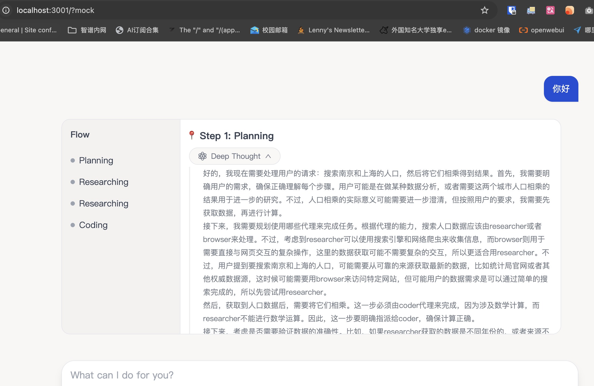

# Langmanus UI


## 开发

> 需要先安装 `node.js`，然后 `npm install -g pnpm` 来安装 `pnpm`


```

mv .env.example .env

pnpm install

pnpm dev
```

## Mock Server 启动

1. 在 `src/core/api/mock.ts` 中，将 `mock.txt` 中的内容替换为 Mock 数据文件名，默认是 `mock-3.txt`。

2. 把浏览器访问的 url 增加一个 query 参数 `mock`，例如：

```
http://localhost:5173/?mock
```

3. 输入问题，直接就用 mock.txt 的内容返回了。


